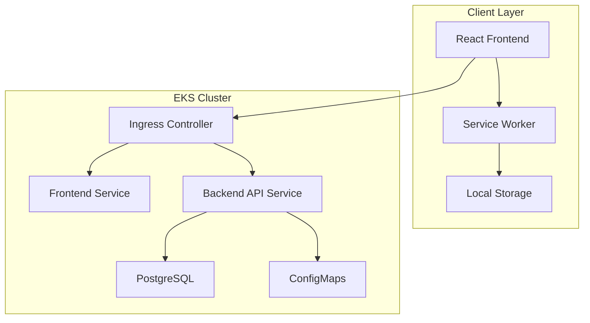

# Design Document

## Overview

The Conference Games web app is a React-based single-page application with a Node.js backend, designed for optimal performance on mobile devices with unreliable network connectivity. The system uses a microservices architecture deployed on AWS EKS, with PostgreSQL for persistence and ConfigMaps for content management.

## Architecture

### High-Level Architecture



### Technology Stack

- **Frontend**: React 18 with TypeScript, Vite for build tooling
- **State Management**: React Context API with useReducer for game state
- **Backend**: Node.js with Express.js and TypeScript
- **Database**: PostgreSQL 15 for session tracking and analytics
- **Containerization**: Docker with multi-stage builds
- **Orchestration**: Kubernetes with Helm charts
- **Ingress**: AWS Load Balancer Controller
- **Monitoring**: Prometheus metrics with health check endpoints

## Components and Interfaces

### Frontend Components

#### 1. App Router Component
- **Purpose**: Main application routing and layout
- **State**: Current game mode, global settings
- **Routes**: 
  - `/` - Landing page
  - `/finish-sentence` - Finish the Sentence game
  - `/guess-acronym` - Guess the Acronym game

#### 2. GameSelector Component
- **Purpose**: Landing page with game mode selection
- **Props**: None
- **Features**: Large buttons, responsive design, dark mode styling

#### 3. FinishSentenceGame Component
- **Purpose**: Manages Finish the Sentence gameplay
- **State**: 
  - Current sentence
  - Timer state (remaining time, running/paused)
  - Category filter
  - Content history
- **Features**: 
  - 30-second configurable timer
  - Category dropdown
  - Keyboard shortcuts
  - Audio alerts

#### 4. GuessAcronymGame Component
- **Purpose**: Manages Guess the Acronym gameplay
- **State**:
  - Current acronym
  - Definition visibility
  - Timer state
  - Content history
- **Features**:
  - 10-second configurable timer
  - Reveal/hide definition toggle
  - Keyboard shortcuts
  - Audio alerts

#### 5. Timer Component
- **Purpose**: Reusable countdown timer with visual and audio feedback
- **Props**: 
  - `duration: number` - Timer duration in seconds
  - `onComplete: () => void` - Callback when timer expires
  - `autoStart: boolean` - Whether to start automatically
- **Features**:
  - Progress bar visualization
  - Numeric countdown display
  - Audio alert on completion
  - Pause/resume on tab visibility change

#### 6. ContentManager Hook
- **Purpose**: Custom hook for content fetching and caching
- **Features**:
  - Local storage caching
  - Offline fallback
  - History tracking for repeat prevention
  - Category filtering

### Backend Services

#### 1. Content API Service
- **Endpoints**:
  - `GET /api/sentences?category=<category>` - Fetch sentences with optional category filter
  - `GET /api/acronyms` - Fetch all acronyms
  - `GET /health` - Health check endpoint
  - `GET /metrics` - Prometheus metrics endpoint

#### 2. Configuration Service
- **Purpose**: Load and serve content from ConfigMaps
- **Features**:
  - Hot reload of ConfigMap changes
  - Content validation
  - Category management

## Data Models

### Frontend Data Models

```typescript
interface Sentence {
  id: string;
  text: string;
  category: string;
}

interface Acronym {
  id: string;
  term: string;
  meaning: string;
}

interface GameState {
  currentItem: Sentence | Acronym | null;
  history: string[];
  timerDuration: number;
  timerRemaining: number;
  isTimerRunning: boolean;
  selectedCategory?: string;
  audioEnabled: boolean;
}

interface TimerState {
  duration: number;
  remaining: number;
  isRunning: boolean;
  isPaused: boolean;
}
```

### Backend Data Models

```typescript
interface ContentConfig {
  sentences: Sentence[];
  acronyms: Acronym[];
}

interface HealthStatus {
  status: 'healthy' | 'unhealthy';
  timestamp: string;
  services: {
    database: boolean;
    configMaps: boolean;
  };
}
```

### Database Schema

```sql
-- Session tracking for analytics (optional)
CREATE TABLE game_sessions (
  id UUID PRIMARY KEY DEFAULT gen_random_uuid(),
  game_type VARCHAR(50) NOT NULL,
  started_at TIMESTAMP DEFAULT NOW(),
  ended_at TIMESTAMP,
  items_shown INTEGER DEFAULT 0,
  category VARCHAR(100)
);

-- Configuration table for runtime settings
CREATE TABLE app_config (
  key VARCHAR(100) PRIMARY KEY,
  value TEXT NOT NULL,
  updated_at TIMESTAMP DEFAULT NOW()
);
```

## Error Handling

### Frontend Error Handling

1. **Network Errors**:
   - Graceful fallback to cached content
   - User notification of offline mode
   - Retry mechanism with exponential backoff

2. **Content Loading Errors**:
   - Display error message with retry option
   - Fallback to default content if available
   - Logging to browser console for debugging

3. **Timer Errors**:
   - Reset timer state on errors
   - Prevent negative timer values
   - Handle tab visibility changes gracefully

### Backend Error Handling

1. **Database Connection Errors**:
   - Health check endpoint reports unhealthy status
   - Graceful degradation for non-essential features
   - Connection retry with circuit breaker pattern

2. **ConfigMap Loading Errors**:
   - Fallback to previous cached content
   - Error logging with structured format
   - Health check reflects ConfigMap status

3. **API Errors**:
   - Consistent error response format
   - Appropriate HTTP status codes
   - Request correlation IDs for tracing

## Testing Strategy

### Frontend Testing

1. **Unit Tests**:
   - Component rendering and behavior
   - Custom hooks functionality
   - Utility functions
   - Timer logic and state management

2. **Integration Tests**:
   - API integration with mock backend
   - Local storage operations
   - Keyboard shortcut handling
   - Timer pause/resume functionality

3. **End-to-End Tests**:
   - Complete game flows
   - Cross-browser compatibility
   - Mobile device testing
   - Offline functionality

### Backend Testing

1. **Unit Tests**:
   - API endpoint handlers
   - Configuration loading
   - Data validation
   - Error handling scenarios

2. **Integration Tests**:
   - Database operations
   - ConfigMap integration
   - Health check endpoints
   - Metrics collection

3. **Load Testing**:
   - Concurrent user scenarios
   - Content serving performance
   - Resource utilization under load

### Deployment Testing

1. **Helm Chart Validation**:
   - Template rendering
   - Resource allocation
   - ConfigMap mounting
   - Service discovery

2. **EKS Integration**:
   - Pod startup and readiness
   - Ingress configuration
   - Horizontal pod autoscaling
   - Rolling updates

## Performance Considerations

### Frontend Optimization

1. **Bundle Size**:
   - Code splitting by route
   - Tree shaking for unused code
   - Compression and minification
   - Lazy loading of non-critical components

2. **Caching Strategy**:
   - Service worker for offline support
   - Local storage for game content
   - Browser caching for static assets
   - Cache invalidation on content updates

3. **Rendering Performance**:
   - React.memo for expensive components
   - useCallback and useMemo optimization
   - Virtual scrolling for large lists (if needed)
   - Debounced user interactions

### Backend Optimization

1. **API Performance**:
   - Response compression
   - Efficient database queries
   - Connection pooling
   - Request/response caching

2. **Resource Management**:
   - Memory usage monitoring
   - CPU optimization
   - Graceful shutdown handling
   - Resource limits in Kubernetes

## Security Considerations

1. **Content Security**:
   - Input validation for API requests
   - XSS prevention in content rendering
   - CORS configuration for API access
   - Content sanitization

2. **Infrastructure Security**:
   - Network policies in Kubernetes
   - Pod security standards
   - Secrets management for sensitive data
   - Regular security updates

3. **Monitoring and Logging**:
   - Structured logging format
   - Security event monitoring
   - Access logging for audit trails
   - Error tracking and alerting

## Deployment Architecture

### Kubernetes Resources

1. **Deployments**:
   - Frontend deployment with nginx
   - Backend API deployment
   - PostgreSQL deployment (or external RDS)

2. **Services**:
   - ClusterIP for internal communication
   - LoadBalancer for external access
   - Headless service for database

3. **ConfigMaps**:
   - Game content (sentences.json, acronyms.json)
   - Application configuration
   - nginx configuration

4. **Ingress**:
   - AWS Load Balancer Controller
   - SSL termination
   - Path-based routing

### Helm Chart Structure

```
conference-games/
├── Chart.yaml
├── values.yaml
├── templates/
│   ├── deployment-frontend.yaml
│   ├── deployment-backend.yaml
│   ├── service-frontend.yaml
│   ├── service-backend.yaml
│   ├── configmap-content.yaml
│   ├── configmap-config.yaml
│   ├── ingress.yaml
│   └── hpa.yaml
└── charts/
    └── postgresql/
```

This design provides a robust, scalable, and maintainable solution that meets all the requirements while ensuring optimal performance on mobile devices with unreliable network connectivity.